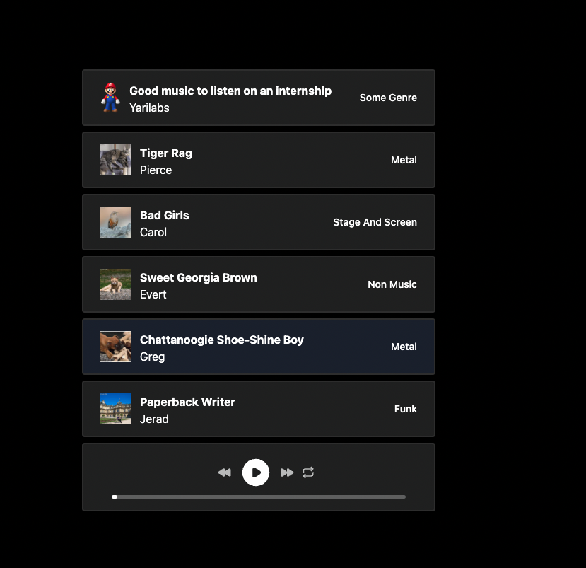

# 📻 Javascript Audio Player



## Installation

Make sure you have `node` and `npm` installed and run the following command:

```bash
npm install
```

## Run the project

Run the following command:

```bash
npm run dev
```

## Exercices

Let's build our own custom audio player.

We should be able to:

- Make the Play / Pause button work (if it's pause show the play button, if it's play show the pause button)
- Make the JumpForward button work (lets jump 10s)
- Make the JumpBack button work (lets go back 30s)
- Make the Reapeat button work (when the audio ends it should loop back and start playing from the start)
- Make the progress bar work

  - change the width of the inner element to the percentage of the played track
  - add a click handler on the progress bar to jump to the clicked spot

## ★ Playlist

As an extra feature instead of playing a local file we want to be able to fetch a playlist from a remote server.

To get the list of songs do a request to `GET /api/songs`

Show the list of songs, artist name, cover image and genre.

I want to be able to play load into my player any song from the list.

## Assets

You can use the icons from whatever site you want I personaly use [Heroicons](https://heroicons.com/).

## How to submit your results

Create a branch with your name and open a pull request.
